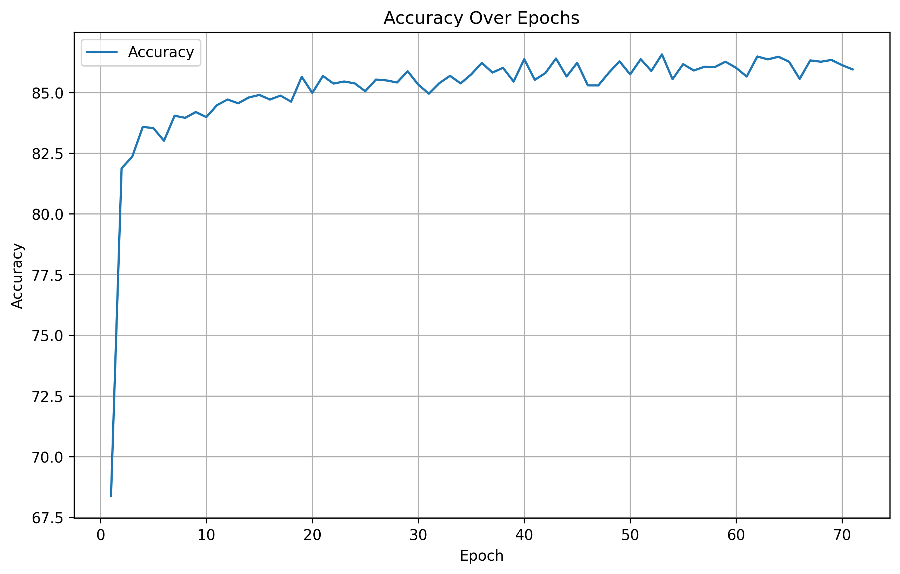

# nba-wins-nnetwork

## Data

I choose to use the [sportsdataverse NBA API](https://py.sportsdataverse.org/docs/nba/) to get NBA box scores from 2017-2022 to predict if the team won or not. This had multiple stats like team_score, points_in_paint, three_point_field_goals_made, etc. I did some cleaning and removed any non-integer/float categories. Also redundant categories like team_turnovers, total_turnovers, and turnovers I simplified.

## Model And Problem

I used Python's other machine learning package, pytorch for this. I created a neural network that took in 29 feautures, used 3 hidden layers, and outputted whether that team won or not. I did this in Python as a full on program, creating 3 files (main.py, model.py where I defined my nn module, and dataapi.py), rather than just an exploratory problem in Colab (Only because this is a small enough problem I could run it on my regular CPU). 

## Results
Best Result was 86.48% accuracy against the validation. This means it was 86.48% accurate over predicting whether a team won or not based on their box score. Here's a graph of the model's accuracy on it's best run so far over it's epochs. 

## Github Repo Link

[Github Repo Link](https://github.com/crawfordk99/nba-xgb-regression)
[Colab-exploration](https://colab.research.google.com/drive/1vYLw7CepdAS0735SLINlz9MfUYMgadlB#scrollTo=YqrSBWGe36DW)